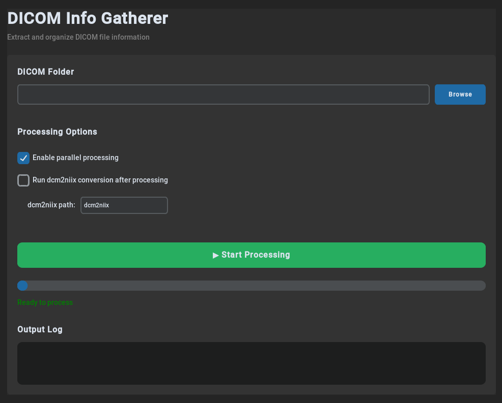

# DICOM Info Gatherer

<p align="center">
  
</p>

## Overview

**DICOM Info Gatherer** is a Python tool for processing DICOM files, extracting metadata, and generating CSV reports. Designed for MRI researchers, with special support for diffusion MRI, fMRI, and Siemens MOSAIC formats.

---

## Features

- **CSV Generation**: Extracts 30+ metadata fields from DICOM files
- **File Organization**: Organizes DICOM files by series
- **Summary Report**: Merges individual CSVs into `*_summary.csv`
- **Parallel Processing**: Multi-threaded for faster execution
- **GUI & CLI**: Both graphical and command-line interfaces

---

## Installation

1. **Clone the repository**:
   ```bash
   git clone https://github.com/yourusername/Dicom-Info-Gatherer.git
   cd Dicom-Info-Gatherer
   ```

2. **Install dependencies**:
   ```bash
   pip install -r requirements.txt
   ```

**Prerequisites**:
- Python 3.7+
- Required: `pydicom`, `pandas`, `numpy`
- Optional: `customtkinter` (modern GUI), `dcm2niix` (NIfTI conversion)

---

## Usage

### Command Line Interface (CLI)

#### Basic Usage

```bash
python process_dicom.py "path/to/dicom/folder"
```

#### Examples

**Windows:**
```cmd
python process_dicom.py "G:\DIFFUSION_PG\PETIT_GROU_2019-02-21\Petit_Grou_20190221_143040754"
```

**Linux/WSL:**
```bash
python process_dicom.py "/path/to/dicomfolder"
```

#### Command Options

```bash
# Disable parallel processing
python process_dicom.py "/path/to/dicomfolder" --no-parallel

# Enable dcm2niix conversion
python process_dicom.py "/path/to/dicomfolder" --dcm2niix

# Specify custom dcm2niix path
python process_dicom.py "/path/to/dicomfolder" --dcm2niix --dcm2niix-path "/usr/local/bin/dcm2niix"

# View all options
python process_dicom.py --help
```

### Graphical User Interface (GUI)

```bash
python process_dicom.py --gui
```


---

## Output

The script generates:

1. **Organized Folders**: DICOM files organized by series
   - Format: `<SeriesNumber>_<SeriesDescription>/`

2. **CSV Output**: `<base_path>_CSV/<folder_name>_summary.csv`
   - Contains comprehensive metadata for all series

3. **NIfTI Output** (optional): `<base_path>_nii/`
   - Contains `.nii.gz`, `.bval`, `.bvec`, `.json` files per series

### Output Structure

```
<base_path>/
├── 1_localizer/
│   └── DICOM files...
├── <base_path>_CSV/
│   └── <folder_name>_summary.csv
└── <base_path>_nii/  (if --dcm2niix enabled)
    └── ...
```

---

## CSV Fields

The `*_summary.csv` file contains one row per series with 30+ fields:

- **Series Info**: FolderName, SeriesNumber, SeriesDescription
- **Dimensions**: X_Dim, Y_Dim, Z_Dim (pixels/slices)
- **Voxel Size**: X_Voxel, Y_Voxel, Z_Voxel, SliceGap (mm)
- **MRI Parameters**: TR, TE, FlipAngle, MagneticFieldStrength (T)
- **Parallel Imaging**: MultibandFactor, InplaneAccelFactor
- **Diffusion MRI** (if applicable): DiffusionBValue, NumberOfVolumes, NumberOfB0s
- **Acquisition**: PhaseEncodingDirection, CoilName, SliceOrientation
- And more...

---

## File Structure

```
Dicom-Info-Gatherer/
├── process_dicom.py          # Main script (CLI + GUI)
├── requirements.txt         # Python dependencies
├── README.md                 # This file
└── GUI.png                   # GUI screenshot
```

---

## Contributing

Contributions welcome! Please submit a Pull Request.

---

## License

MIT License

---

## Acknowledgments

- [pydicom](https://github.com/pydicom/pydicom) - DICOM file handling
- [dcm2niix](https://github.com/rordenlab/dcm2niix) - NIfTI conversion
- [CustomTkinter](https://github.com/TomSchimansky/CustomTkinter) - Modern GUI framework
